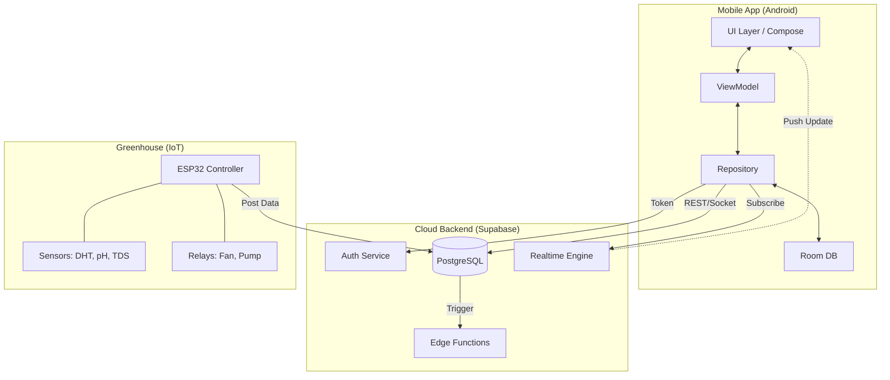
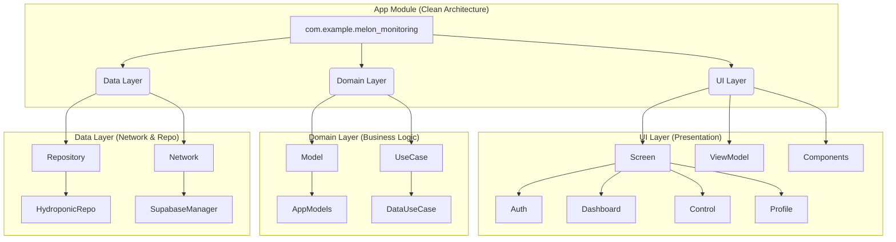

# 🌱 Greenhouse Monitoring App


> **Aplikasi Android berbasis IoT untuk monitoring dan kontrol sistem greenhouse hidroponik secara real-time.**

---

## 📑 Daftar Isi
- [Screenshots](#-screenshots)
- [Tentang Proyek](#-tentang-proyek)
- [Fitur Utama](#-fitur-utama)
- [Arsitektur Teknis](#-arsitektur-teknis)
- [Persiapan & Instalasi](#-persiapan--instalasi-quick-start)
- [Struktur Database](#-struktur-database)
- [Dokumentasi](#-dokumentasi-terkait)
- [Kontribusi](#-kontribusi)

---

## 📱 Screenshots

| Login / Auth | Dashboard Monitoring | Kontrol Perangkat | Detail History |
|:---:|:---:|:---:|:---:|
|  |  |  |  |

---

## 📌 Tentang Proyek

**Greenhouse Monitoring App** dibangun untuk mempermudah petani hidroponik dalam memantau parameter vital tanaman dari jarak jauh. Aplikasi ini mengadopsi arsitektur modern (**MVVM + Clean Architecture**) dengan pendekatan UI deklaratif menggunakan **Jetpack Compose**.

Sistem ini menjembatani komunikasi antara tiga entitas utama:
1.  **Android App**: Antarmuka pengguna untuk visualisasi data & kontrol.
2.  **Supabase Cloud**: Backend-as-a-Service (BaaS) untuk Auth, Database, dan Realtime subscription.
3.  **IoT Device**: Perangkat keras (ESP32) yang mengelola sensor dan aktuator fisik.

---

## 🎯 Fitur Utama

### 🔐 Autentikasi & Keamanan
* ✅ **Secure Login:** Autentikasi aman menggunakan Supabase Auth.
* ✅ **User Management:** Registrasi, Reset Password, dan Update Profil.
* ✅ **Data Privacy:** Penerapan *Row Level Security* (RLS) memastikan pengguna hanya mengakses greenhouse miliknya.

### 📊 Monitoring Real-time
* 🌡️ **Lingkungan:** Pantau Suhu & Kelembapan udara greenhouse.
* 💧 **Kualitas Air:** Monitoring pH, TDS (PPM), dan Suhu Air nutrisi.
* 📈 **History Data:** Visualisasi grafik tren kondisi tanaman (24 jam / 7 hari terakhir).

### 🔧 Kontrol & Otomasi
* 🌀 **Smart Control:** Kendalikan Kipas (Blower) dan Pompa Air dari jarak jauh.
* 🤖 **Automation Mode:** Atur *threshold* (ambang batas) agar perangkat bekerja otomatis berdasarkan sensor.

---

## 🏗️ Arsitektur Teknis

Aplikasi ini dibangun dengan prinsip **Separation of Concerns** menggunakan pola **MVVM**.

### Tech Stack

| Kategori | Teknologi |
| :--- | :--- |
| **Language** | Kotlin |
| **UI Framework** | Jetpack Compose (Material 3) |
| **Architecture** | MVVM + Clean Architecture |
| **DI** | Dagger Hilt |
| **Async** | Coroutines + Flow |
| **Backend** | Supabase (PostgreSQL, Auth, Realtime) |
| **IoT Protocol** | MQTT / REST via Supabase Edge Functions |

### Diagram Arsitektur (High Level)



## 🚀 **Persiapan & Instalasi (Quick Start)**

### Prasyarat
- Android Studio Merkeet (2023.1.1) ke atas
- JDK 17
- Akun Supabase (gratis)
- Perangkat Android atau Emulator (API 24+)

### Langkah 1: Clone Repository
``` bash
git clone https://github.com/HaritsDetya/Melon_Monitoring_and_Automation.git
cd Melon_Monitoring_and_Automation
```

### Langkah 2: Setup Supabase
1. Buat project baru di supabase.com
2. Copy URL dan Anon Key dari Project Settings → API
3. Buat file local.properties di root project:
    ```properties
    # Supabase Configuration
    SUPABASE_URL=https://your-project.supabase.co
    SUPABASE_ANON_KEY=eyJ.....
    
    # Optional: Untuk Edge Functions
    ADMIN_DELETE_SECRET=your-secret-for-delete-function
    ```

### Langkah 3: Setup Database
Jalankan script SQL berikut di Supabase SQL Editor:
```sql
-- 1. Jalankan semua CREATE TABLE statements
-- 2. Jalankan semua CREATE FUNCTION statements  
-- 3. Enable RLS dan setup policies
-- 4. Deploy Edge Functions
```

### Langkah 4: Build & Run
1. Buka project di Android Studio
2. Lakukan **Sync Project with Gradle Files**
3. Hubungkan device fisik atau jalankan Emulator
4. Klik **Run** (Shift + F10)

## 📁 **Project Structure**


## 📚 **Dokumentasi Terkait**

|                  Dokumen                   |                        Deskripsi                         |        Target Pembaca         |
|:------------------------------------------:|:--------------------------------------------------------:|:-----------------------------:|
|         [DATABASE.md](DATABASE.md)         |      	Dokumentasi teknis database Supabase lengkap       |  Backend Dev, Database Admin  |
| [API_REFERENCE.md](docs/API_REFERENCE.md)  |            API endpoints dan payload examples            |   Mobile Dev, IoT Developer   |
|  [ARCHITECTURE.md ](docs/ARCHITECTURE.md)  |                	Diagram arsitektur detail                |     Tech Lead, Architect      |

## 🤝 **Kontribusi**
Cara Berkontribusi
1. Fork repository ini
2. Buat branch untuk fitur baru:
   ```bash
   git checkout -b feature/amazing-feature
   ```
3. Commit perubahan:
   ```bash
   git commit -m 'feat: add amazing feature'
   ```
4. Push ke branch :
   ```bash
   git push origin feature/amazing-feature
   ```
5. Buat Pull Request.

## **Coding Standards**
- Gunakan Kotlin dengan style official
- Architecture: Ikuti MVVM + Clean Architecture
- Documentation: Update README jika ada perubahan besar

## **Issue Labels**
- `bug` - Sesuatu tidak berfungsi
- `enhancement` - Perbaikan fitur yang ada
- `feature` - Fitur baru
- `documentation` - Perbaikan dokumentasi
- `help wanted` - Butuh bantuan komunitas

## 📄 **Lisensi**
```text
MIT License

Copyright (c) 2024 Harits
```

## 📊 Project Stats:
- 📱 **Version**: 1.0.0 (Beta)
- 🏗️ **Architecture**: MVVM + Clean Architecture
- 🔄 **Last Updated**: December 2025
