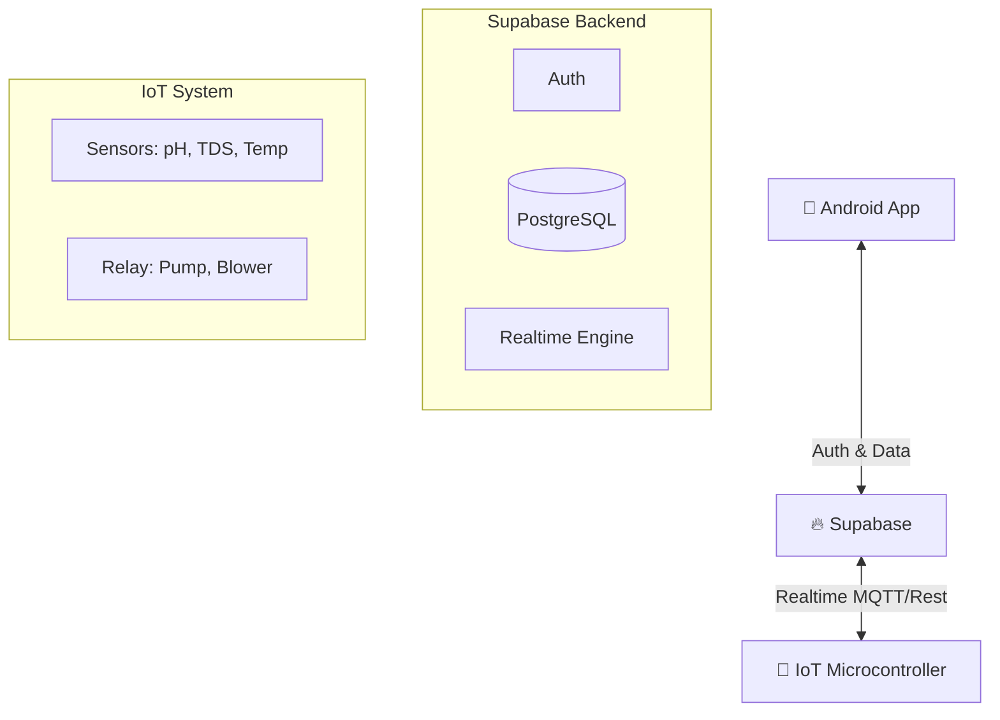

# 🌱 Greenhouse Monitoring App

   

Aplikasi Android berbasis **Jetpack Compose** yang terintegrasi dengan **Supabase** serta sistem IoT untuk monitoring kondisi greenhouse dan kontrol perangkat secara *real-time*.

## 📱 Screenshots

| Login / Auth | Dashboard Monitoring | Kontrol Perangkat | Detail History |
|:---:|:---:|:---:|:---:|
|  |  |  |  |
> *Catatan: Screenshot aplikasi.*

## 📌 Deskripsi Proyek

Greenhouse Monitoring App dibangun untuk mempermudah petani hidroponik dalam memantau parameter vital tanaman dari jarak jauh. Aplikasi ini mengadopsi arsitektur modern (MVVM) dengan pendekatan UI deklaratif (Compose).

Sistem ini menjembatani komunikasi antara:
1.  **Pengguna (Android App)**: Interface pemantauan dan kontrol.
2.  **Server (Supabase)**: Pusat autentikasi, database, dan real-time engine.
3.  **Hardware (IoT)**: Sensor fisik dan aktuator di lapangan.

## 🚀 Fitur Utama

### 🔐 Autentikasi Pengguna
* **Sign Up & Login**: Menggunakan Supabase Auth (Email/Password).
* **Deep Link Reset Password**: Integrasi email untuk reset password yang aman.
* **Manajemen Akun**: Update password, logout, dan penghapusan akun.

### 📊 Dashboard Monitoring (Real-time)
Menampilkan data sensor terkini:
* 🌡️ **Lingkungan**: Suhu Udara & Kelembapan.
* 💧 **Kualitas Air**: Suhu Air, pH, dan TDS (Total Dissolved Solids).
* 📈 **History**: Grafik riwayat data sensor untuk analisis tren.

### 🔧 Kontrol Perangkat (Actuators)
Kontrol jarak jauh untuk perangkat keras:
* ✅ **Blower**: Mengatur sirkulasi udara.
* ✅ **Pompa Air**: Mengatur irigasi/sirkulasi air.

## 🏗️ Arsitektur Sistem

Aplikasi ini menggunakan pola **MVVM (Model-View-ViewModel)** dan **Clean Architecture** sederhana.

### Alur Data

### Komponen Teknis
* Android Client:
    * UI: Jetpack Compose
    * State Management: ViewModel & StateFlow
    * Network: Ktor / Supabase-kt
    * DI: Hilt (Dagger)
* Supabase Backend:
    * Auth: Mengelola sesi pengguna.
    * Database: Menyimpan data users, devices, dan log sensor.
    * Realtime: Broadcast perubahan data sensor ke aplikasi instan.
