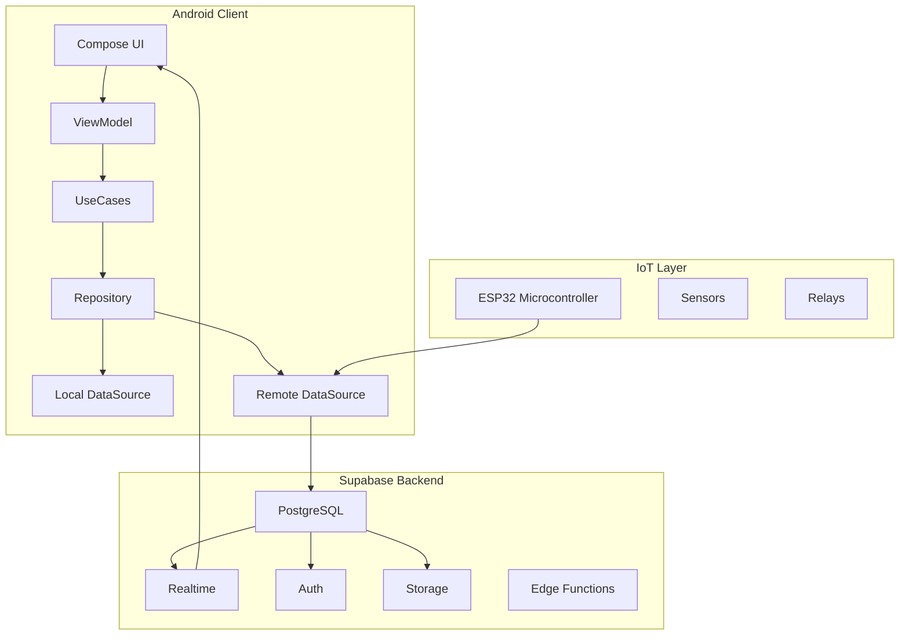

# 🏗️ Architecture Documentation


> **Dokumentasi arsitektur teknis lengkap untuk Greenhouse Monitoring App**

## 📋 Daftar Isi
- [Architecture Overview](#-architecture-overview)
- [Clean Architecture Layers](#-clean-architecture-layers)
- [Data Flow](#-data-flow)
- [Component Diagram](#-component-diagram)
- [Dependency Injection](#-dependency-injection)
- [State Management](#-state-management)
- [Navigation](#-navigation)
- [Testing Strategy](#-testing-strategy)
- [Performance Considerations](#-performance-considerations)

## 🎯 Architecture Overview

### High-Level Architecture

| Presentation Layer  |  (UI Components, ViewModels, Navigation)  |
|:-------------------:|:-----------------------------------------:|
|    Domain Layer     |   (Use Cases, Business Rules, Entities)   |
|     Data Layer      |   (Repositories, Data Sources, Mappers)   |
|   Framework Layer   |       (Supabase, Room, System APIs)       |


### Tech Stack Diagram


## 🏛️ **Clean Architecture Layers**

### 1. **Presentation Layer**

**Purpose**: Menangani UI dan user interaction

**Components**:
* **Screens**: Composable functions untuk setiap screen
* **ViewModels**: Menyimpan UI state dan business logic
* **UI Components**: Reusable composables
* **Navigation**: Mengelola screen transitions

**Example Structure**:
```text
presentation/
├── screen/
│   ├── auth/
│   │   ├── LoginScreen.kt
│   │   └── RegisterScreen.kt
│   ├── dashboard/
│   │   ├── DashboardScreen.kt
│   │   └── DashboardViewModel.kt
│   └── greenhouse/
│       ├── detail/
│       └── list/
├── component/
│   ├── SensorCard.kt
│   ├── ControlSwitch.kt
│   └── ChartComponent.kt
└── theme/
    ├── Colors.kt
    ├── Typography.kt
    └── Theme.kt
```

### 2. **Domain Layer**

**Purpose**: Business logic dan enterprise rules

**Components**:
* Entities: Business objects (User, Greenhouse, SensorReading)
* Use Cases: Single responsibility business operations
* Repository Interfaces: Contracts untuk data access

**Example Use Case**:
```kotlin
class GetLatestSensorReadingsUseCase(
    private val repository: SensorRepository
) {
    suspend operator fun invoke(greenhouseId: String): Result<SensorReading> {
        return repository.getLatestReading(greenhouseId)
    }
}
```

### 3. **Data Layer**

**Purpose**: Mengelola data dari berbagai sources

**Components**:
* **Repositories**: Implementasi repository interfaces
* **Data Sources**: Local (Room) dan remote (Supabase)
* **Mappers**: Convert antara domain dan data models
* **DTOs**: Data Transfer Objects

**Repository Pattern**:
```kotlin
class SensorRepositoryImpl(
    private val remoteDataSource: SensorRemoteDataSource,
    private val localDataSource: SensorLocalDataSource,
    private val mapper: SensorMapper
) : SensorRepository {
    
    override suspend fun getLatestReading(greenhouseId: String): Result<SensorReading> {
        return try {
            // Try remote first
            val remoteData = remoteDataSource.getLatest(greenhouseId)
            val domainEntity = mapper.mapToDomain(remoteData)
            
            // Cache to local
            localDataSource.saveReading(mapper.mapToLocal(remoteData))
            
            Result.success(domainEntity)
        } catch (e: Exception) {
            // Fallback to local cache
            val localData = localDataSource.getLatest(greenhouseId)
            Result.success(mapper.mapToDomain(localData))
        }
    }
}
```

### 4. **Framework Layer**

**Purpose**: External dependencies dan platform-specific code

**Components**:
* **Supabase Client**: HTTP client untuk Supabase API
* **Room Database**: Local persistence
* **WorkManager**: Background tasks
* **System Services**: Location, Notifications, etc.

## 🔄 **Data Flow**

### **Authentication Flow**
```sequenceDiagram
    participant U as User
    participant UI as LoginScreen
    participant VM as LoginViewModel
    participant UC as LoginUseCase
    participant REPO as AuthRepository
    participant SB as Supabase Auth

    U->>UI: Enter credentials
    UI->>VM: onSubmit()
    VM->>UC: invoke(email, password)
    UC->>REPO: login(email, password)
    REPO->>SB: signInWithEmail()
    SB-->>REPO: AuthResponse
    REPO-->>UC: User
    UC-->>VM: Result<User>
    VM->>UI: Navigate to Dashboard
```

### **Sensor Data Flow**
```sequenceDiagram
    participant I as IoT Device
    participant SB as Supabase Database
    participant EF as Edge Function
    participant SH as Sensor History
    participant RT as Realtime
    participant A as Android App

    I->>SB: POST sensor_readings
    SB->>EF: Trigger copy-to-history
    EF->>SH: Insert 5 rows
    SB->>RT: Broadcast INSERT
    RT->>A: New data via WebSocket
    A->>A: Update UI
```

## 🧩 **Component Diagram**

### **Authentication Module**
```text
┌─────────────────────────┐
│   AuthenticationModule  │
├─────────────────────────┤
│ Provides:               │
│ • AuthRepository        │
│ • LoginUseCase          │
│ • RegisterUseCase       │
│ • SessionManager        │
└─────────────────────────┘
           │
           ▼
┌─────────────────────────┐
│     SupabaseModule      │
├─────────────────────────┤
│ • SupabaseClient        │
│ • Auth API              │
│ • Realtime Connection   │
└─────────────────────────┘
```

### **Sensor Module**
```text
┌─────────────────────────┐
│      SensorModule       │
├─────────────────────────┤
│ • SensorRepository      │
│ • GetReadingsUseCase    │
│ • ControlDeviceUseCase  │
│ • AutomationUseCase     │
└─────────────────────────┘
           │
           ▼
┌─────────────────────────┐
│   DataSourceModule      │
├─────────────────────────┤
│ • SensorRemoteDataSource│
│ • SensorLocalDataSource │
│ • ControlDataSource     │
└─────────────────────────┘
```

## 💉 **Dependency Injection**

### **Hilt Modules Structure**
```kotlin
// AppModule.kt
@Module
@InstallIn(SingletonComponent::class)
object AppModule {
    
    @Provides
    @Singleton
    fun provideSupabaseClient(): SupabaseClient {
        return createSupabaseClient(
            supabaseUrl = BuildConfig.SUPABASE_URL,
            supabaseKey = BuildConfig.SUPABASE_ANON_KEY
        )
    }
    
    @Provides
    @Singleton
    fun provideAuthRepository(
        client: SupabaseClient
    ): AuthRepository {
        return AuthRepositoryImpl(client)
    }
}

// ViewModelModule.kt
@Module
@InstallIn(ViewModelComponent::class)
abstract class ViewModelModule {
    
    @Binds
    abstract fun bindSensorRepository(
        impl: SensorRepositoryImpl
    ): SensorRepository
    
    @ViewModelScoped
    @Provides
    fun provideDashboardViewModel(
        repository: SensorRepository
    ): DashboardViewModel {
        return DashboardViewModel(repository)
    }
}
```

### **Dependency Graph**
```kotlin
@AndroidEntryPoint
class MainActivity : ComponentActivity() {
    // Dependencies injected automatically
}

@HiltViewModel
class DashboardViewModel @Inject constructor(
    private val getReadingsUseCase: GetLatestSensorReadingsUseCase,
    private val controlDeviceUseCase: ControlDeviceUseCase
) : ViewModel() {
    // ViewModel with dependencies
}
```

## 🎛️ **State Management**

### **UI State Pattern**
```kotlin
// Sealed class untuk state management
sealed interface DashboardState {
    object Loading : DashboardState
    data class Success(
        val sensorData: SensorData,
        val controlState: ControlState
    ) : DashboardState
    data class Error(val message: String) : DashboardState
}

// ViewModel dengan StateFlow
@HiltViewModel
class DashboardViewModel @Inject constructor(
    private val repository: SensorRepository
) : ViewModel() {
    
    private val _uiState = MutableStateFlow<DashboardState>(DashboardState.Loading)
    val uiState: StateFlow<DashboardState> = _uiState.asStateFlow()
    
    init {
        loadData()
    }
    
    private fun loadData() {
        viewModelScope.launch {
            _uiState.value = DashboardState.Loading
            try {
                val sensorData = repository.getLatestReading(greenhouseId)
                val controlState = repository.getControlState(greenhouseId)
                _uiState.value = DashboardState.Success(sensorData, controlState)
            } catch (e: Exception) {
                _uiState.value = DashboardState.Error(e.message ?: "Unknown error")
            }
        }
    }
}
```

### **Compose UI dengan State Hoisting**
```kotlin
@Composable
fun DashboardScreen(
    viewModel: DashboardViewModel = hiltViewModel()
) {
    val uiState by viewModel.uiState.collectAsState()
    
    when (val state = uiState) {
        is DashboardState.Loading -> LoadingScreen()
        is DashboardState.Success -> DashboardContent(
            sensorData = state.sensorData,
            controlState = state.controlState,
            onControlToggle = { device, enabled ->
                viewModel.toggleControl(device, enabled)
            }
        )
        is DashboardState.Error -> ErrorScreen(
            message = state.message,
            onRetry = { viewModel.retry() }
        )
    }
}
```

## 🧭 **Navigation**

### **Navigation Graph**
```kotlin
@Composable
fun GreenhouseApp() {
    val navController = rememberNavController()
    
    NavHost(
        navController = navController,
        startDestination = if (isLoggedIn()) "dashboard" else "auth"
    ) {
        // Auth Graph
        navigation(
            route = "auth",
            startDestination = "login"
        ) {
            composable("login") { LoginScreen(navController) }
            composable("register") { RegisterScreen(navController) }
            composable("forgot-password") { ForgotPasswordScreen(navController) }
        }
        
        // Main Graph
        navigation(
            route = "main",
            startDestination = "dashboard"
        ) {
            composable("dashboard") { DashboardScreen(navController) }
            composable("greenhouse/{id}") { backStackEntry ->
                val greenhouseId = backStackEntry.arguments?.getString("id")
                GreenhouseDetailScreen(greenhouseId, navController)
            }
            composable("control/{id}") { backStackEntry ->
                val greenhouseId = backStackEntry.arguments?.getString("id")
                ControlScreen(greenhouseId, navController)
            }
        }
    }
}
```

### **Deeplink Support**
```kotlin
// Deep link untuk reset password
composable(
    route = "reset-password",
    deepLinks = listOf(
        navDeepLink {
            uriPattern = "melongreenhouse://reset-password/{token}"
        }
    )
) { backStackEntry ->
    val token = backStackEntry.arguments?.getString("token")
    ResetPasswordScreen(token, navController)
}
```

## 🧪 **Testing Strategy**

### **Testing Pyramid**
```text
        ┌─────────────────┐
        │   UI Tests      │ 10%
        │  (Compose UI)   │
        └─────────────────┘
               │
        ┌─────────────────┐
        │ Integration     │ 20%
        │  Tests          │
        └─────────────────┘
               │
        ┌─────────────────┐
        │   Unit Tests    │ 70%
        │ (ViewModel, Use │
        │  Cases, Repo)   │
        └─────────────────┘
```

### **Unit Test Examples**
```kotlin
// ViewModel Test
@HiltAndroidTest
class DashboardViewModelTest {
    
    @get:Rule
    val hiltRule = HiltAndroidRule(this)
    
    @Inject
    lateinit var repository: FakeSensorRepository
    
    private lateinit var viewModel: DashboardViewModel
    
    @Before
    fun setup() {
        hiltRule.inject()
        viewModel = DashboardViewModel(repository)
    }
    
    @Test
    fun `loadData should update state to Success`() = runTest {
        // Given
        val expectedData = SensorData.mock()
        repository.setMockData(expectedData)
        
        // When
        viewModel.loadData("greenhouse-123")
        
        // Then
        val state = viewModel.uiState.value
        assertThat(state).isInstanceOf(DashboardState.Success::class.java)
    }
}

// Repository Test
class SensorRepositoryTest {
    
    @Test
    fun `getLatestReading should return cached data when offline`() = runTest {
        // Given
        val localDataSource = FakeLocalDataSource()
        val remoteDataSource = FakeRemoteDataSource(shouldFail = true)
        val repository = SensorRepositoryImpl(localDataSource, remoteDataSource)
        
        // When
        val result = repository.getLatestReading("greenhouse-123")
        
        // Then
        assertThat(result.isSuccess).isTrue()
        assertThat(result.getOrNull()).isEqualTo(localDataSource.cachedData)
    }
}
```

### **UI Test with Compose**
```kotlin
@HiltAndroidTest
class DashboardScreenTest {
    
    @get:Rule
    val composeTestRule = createComposeRule()
    
    @Test
    fun shouldDisplaySensorData() {
        // Given
        val viewModel = FakeDashboardViewModel()
        viewModel.setMockState(DashboardState.Success(mockData, mockControl))
        
        // When
        composeTestRule.setContent {
            GreenhouseAppTheme {
                DashboardScreen(viewModel = viewModel)
            }
        }
        
        // Then
        composeTestRule
            .onNodeWithText("Temperature")
            .assertIsDisplayed()
        
        composeTestRule
            .onNodeWithText("28.5°C")
            .assertIsDisplayed()
    }
}
```

## ⚡ **Performance Considerations**

### **Network Optimization**
```kotlin
// Implement caching strategy
class SensorRepositoryImpl(
    private val remoteDataSource: SensorRemoteDataSource,
    private val localDataSource: SensorLocalDataSource,
    private val dispatcher: CoroutineDispatcher = Dispatchers.IO
) : SensorRepository {
    
    private val cache = Cache<SensorData>(
        maxSize = 10,
        expireAfterWrite = 5.minutes
    )
    
    override suspend fun getLatestReading(greenhouseId: String): Result<SensorData> {
        return withContext(dispatcher) {
            // Check cache first
            cache.get(greenhouseId)?.let { cachedData ->
                return@withContext Result.success(cachedData)
            }
            
            // Fetch from network
            val result = remoteDataSource.getLatest(greenhouseId)
            result.onSuccess { data ->
                cache.put(greenhouseId, data)
                localDataSource.saveReading(data)
            }
            
            result
        }
    }
}
```

### **Image Loading Optimization**
```kotlin
@Composable
fun GreenhouseImage(
    url: String,
    modifier: Modifier = Modifier
) {
    val imageLoader = ImageLoader.Builder(LocalContext.current)
        .components {
            if (Build.VERSION.SDK_INT >= 28) {
                add(ImageDecoderDecoder.Factory())
            } else {
                add(GifDecoder.Factory())
            }
        }
        .build()
    
    AsyncImage(
        model = ImageRequest.Builder(LocalContext.current)
            .data(url)
            .diskCacheKey(url)
            .memoryCacheKey(url)
            .build(),
        contentDescription = "Greenhouse image",
        modifier = modifier,
        imageLoader = imageLoader
    )
}
```

### **Memory Management**
```kotlin
@Composable
fun LazySensorList(
    sensors: List<SensorData>,
    onSensorClick: (SensorData) -> Unit
) {
    LazyColumn {
        items(
            items = sensors,
            key = { sensor -> sensor.id } // Key untuk stable updates
        ) { sensor ->
            SensorCard(
                sensor = sensor,
                onClick = { onSensorClick(sensor) },
                modifier = Modifier.animateItemPlacement() // Smooth animations
            )
        }
    }
}
```

## 🔧 **Debugging & Monitoring**

### **Logging Strategy**
```kotlin
interface AppLogger {
    fun debug(tag: String, message: String)
    fun info(tag: String, message: String)
    fun warning(tag: String, message: String)
    fun error(tag: String, message: String, throwable: Throwable? = null)
}

// Timber implementation
class TimberLogger : AppLogger {
    override fun debug(tag: String, message: String) {
        Timber.tag(tag).d(message)
    }
    
    override fun error(tag: String, message: String, throwable: Throwable?) {
        Timber.tag(tag).e(throwable, message)
    }
}
```

### **Performance Monitoring**
```kotlin
class PerformanceMonitor {
    
    fun trackScreenLoad(screenName: String) {
        val startTime = System.currentTimeMillis()
        
        // Track loading time
        // Send to analytics
    }
    
    fun trackApiCall(
        endpoint: String,
        duration: Long,
        success: Boolean
    ) {
        // Log API performance
        // Alert if response time > threshold
    }
}
```

## 📦 **Build Configuration**

### **Module Structure**
```groovy
// build.gradle.kts (app module)
android {
    buildFeatures {
        compose = true
    }
    
    composeOptions {
        kotlinCompilerExtensionVersion = "1.5.4"
    }
    
    buildTypes {
        debug {
            applicationIdSuffix ".debug"
            debuggable true
        }
        
        release {
            minifyEnabled true
            proguardFiles getDefaultProguardFile("proguard-android.txt")
            signingConfig signingConfigs.release
        }
    }
    
    flavorDimensions += "environment"
    productFlavors {
        create("dev") {
            dimension = "environment"
            applicationIdSuffix ".dev"
        }
        
        create("prod") {
            dimension = "environment"
        }
    }
}
```

### **Dependency Management**
```kotlin
// Version catalogs (libs.versions.toml)
[versions]
compose = "1.5.4"
supabase = "2.0.0"
hilt = "2.48"

[libraries]
compose-ui = { module = "androidx.compose.ui:ui"; version.ref = "compose" }
compose-material3 = { module = "androidx.compose.material3:material3"; version = "1.1.2" }
supabase-auth = { module = "io.github.jan-tennert.supabase:gotrue-kt"; version.ref = "supabase" }
hilt-android = { module = "com.google.dagger:hilt-android"; version.ref = "hilt" }
```

## 🚀 **Deployment Strategy**

### **CI/CD Pipeline**
```yaml
# .github/workflows/android-ci.yml
name: Android CI

on:
  push:
    branches: [ main, develop ]
  pull_request:
    branches: [ main ]

jobs:
  build:
    runs-on: ubuntu-latest
    
    steps:
      - name: Checkout
        uses: actions/checkout@v3
      
      - name: Setup JDK 17
        uses: actions/setup-java@v3
        with:
          java-version: '17'
          
      - name: Setup Android SDK
        uses: android-actions/setup-android@v2
      
      - name: Build with Gradle
        run: ./gradlew build
        
      - name: Run tests
        run: ./gradlew test
        
      - name: Upload test results
        uses: actions/upload-artifact@v3
        if: always()
        with:
          name: test-results
          path: app/build/reports/tests/
```

## 📚 **References**

* [Android Architecture Guidelines](https://developer.android.com/topic/architecture)
* [Compose Navigation](https://developer.android.com/jetpack/compose/navigation)
* [Hilt Documentation](https://dagger.dev/hilt/)
* [Supabase Kotlin SDK](https://supabase.com/docs/reference/kotlin/introduction)

___
**Architecture Version**: 1.0.0
**Last Updated**: December 2025
